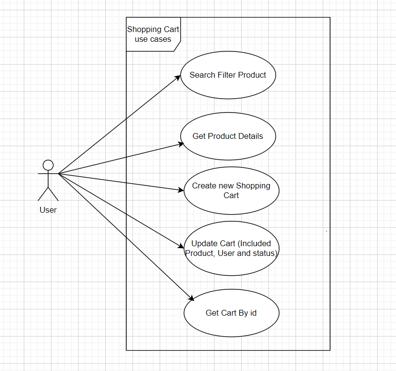
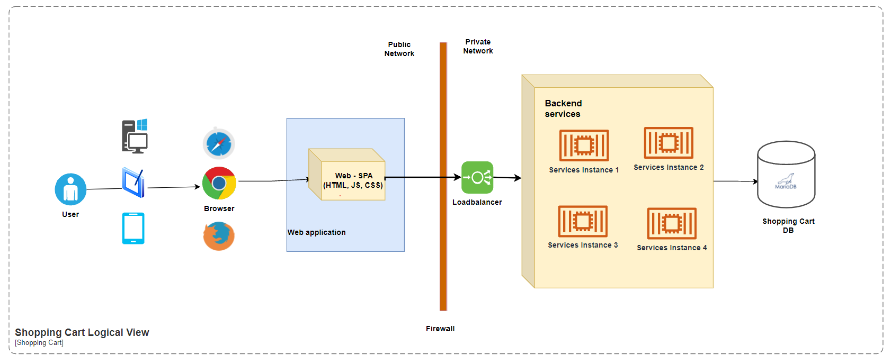
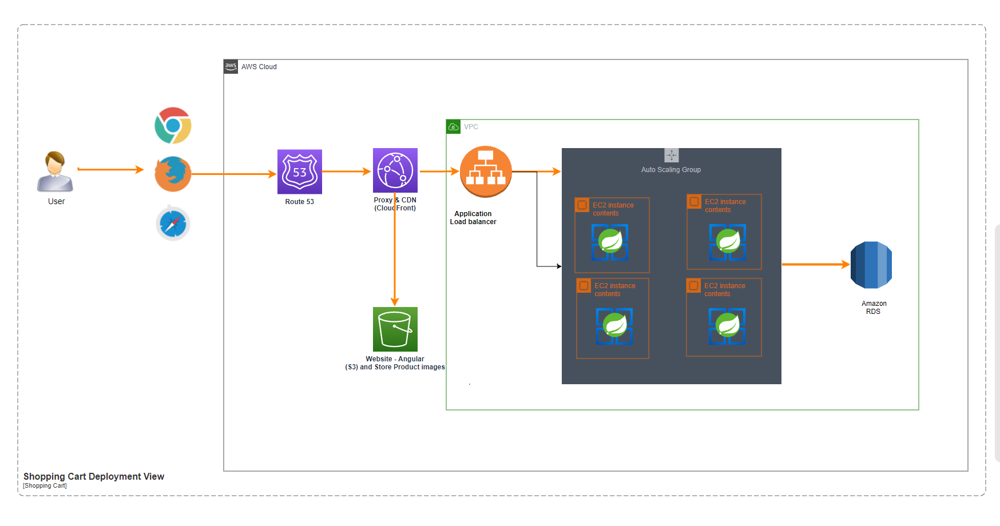
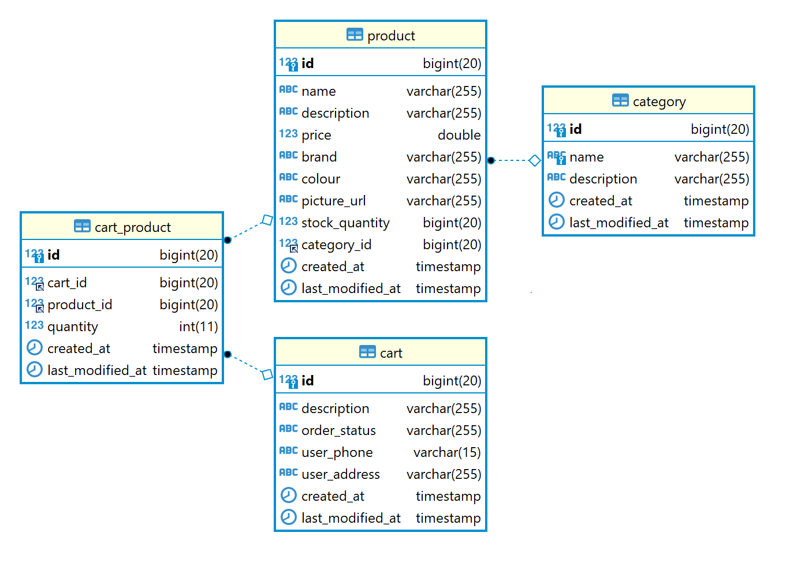

## Shopping App Backend API

The backend of the simple Shopping Application 

### Product Introduction:
This project aim to build an MVP version of a Shopping Cart application with limited functionalities:
1. The application is simply a simple web page that shows all products on which customers can filter and search for products based on different criteria such as product category, name, price, brand, colour.
2. If the customer finds a product that they like, they can view its details and add it to their shopping cart and proceed to place an order.
3. No online payment is supported yet. The customer is required to pay by cash when the product got delivered

### Use cases Diagram:
Due to the MVP approach, we simply the user journey by some use cases as the diagram:

### Architecture Design:
The design is oriented to cloud environment which very easy to deploy and roll-out product to the market.
Moreover, if the number user/functionalities increase, it's easy to add more services/components or switch to the more modern architecture like Microservices.    
Here is some view on the architecture of system:
- Logical View:
  - Separated the network into two zone: public and private
  - All services backend can be horizontal scaling

- Technology stack and deployment view: Deploy on Amazon Infrastructure
  - Angular as a Frontend framework
  - Amazon RDS as the database
  - Spring Boot back end API will be deployed to EC2 instances inside an Autoscaling group
  - Amazon Application Load balancer as a server side load balancing
  - Using Amazon S3 for static web hosting (Fronted code will be pushed to S3 Bucket). And use Route 53 as DNS service also CloudFront act as the CDN

### Database design:

1. **category**: table to store information about Product Category
2. **product**: table to store information about Product. Each product could be linked with a Category
3. **cart**: table to store the Cart which created by the end user.
4. **cart_product**: the mapping table between Cart and Product

This is the very simple design. It is focus on marketing strategy first.
It doesn't have any User management feature, so any guest user come to site can be use all functionalities.
The information about User and Order has been managed in the same table <code>Cart</code>. 
To make a cart belong an order, simply use only need using api update Cart with the order status is _ORDERED_  

**Indexing strategy**: By assumption that user will often search by product name, brand, colour, price. So it needs to create DB index for the fields <code>name</code>, <code>brand</code>, <code>colour</code>, <code>price</code> of the <code>product</code> table. 

### Development Principles and Practices being applied:
1. Test Driven Development approach:
- Each Class/method has been design and implement for testable.
- This approach has been reflected by the number of Unit test cases in test package
2. Don’t Repeat Yourself:
- All functionalities if possible to reuse has been put into the Method or Service/Utility class. 
3. Keep It Simple Stupid: 
- All the methods in all classes have been organized with small number line of code
- Each method/class only follow the concept : "Do one thing and Do good"
4. You are not Gonna Need It:
- All unused code has been removed. We only keep the classes/functions which needed. 
- Example: we do not provide any endpoint/service to insert new Product/Category due to in this phase, we have not any features related to them.  
5. SOLID:
   - Each class or interface only responsible to do the business logic relate to that entities(<code>Product</code>, <code>Cart</code>, <code>Category</code>)
   - The search/filtering logic has been implemented by Generic programming style. 
     In the future, if we want to search with another entity, we only have to add new Class extends the existing <code>GenericSpecification</code>, no need to re-implement searching/filtering logic   
   - Each Interface has been divided and separated small and independent to take its business
   - Widely using the Dependency Injection. The Class/Layer depend on each other by abstraction, not by Implementation

### Key framework used:
The project is a Spring boot based application with following library used: 
- **spring-boot-starter-web**: Starter for building web, including RESTful, applications using Spring MVC. Uses Tomcat as the default embedded container
- **spring-boot-starter-data-jpa**: Using as ORM framework to connect and interact with Database
- **spring-boot-starter-validation**: Validation request/response for APIs
- **org.projectlombok**: Automatic Resource Management, automatic generation of getters, setters, equals, hashCode and toString, and more!. It helps reduce almost boilerplate code by using some simple annotations
- **org.mapstruct**: An annotation processor for generating type-safe bean mappers. Useful to mapping between request, response, entities in declarative way
- **org.liquibase**: A tool for managing and executing database changes
- **org.springdoc**: Documentation generator for APIs

### Project Code structure:
The Project has been organized in **Layered Architecture** with 3 main layers: User Interface, Business and Repository: 

- **controller**: The Controller classes to accept all incoming requests from Web frontend
- **controller/dto**: The POJO objects for incoming request / outgoing response
- **service**: The package to contain all business logic 
- **repository**: The Classes to interact with database
- **repository/model**: The entities mapping with database table 
- **exception**: The predefined exceptions and Exception Handling

### Running application:
1. Running with H2 DB (Does not require any additional installation)
   1. Build jar file
      > ./mvnw clean package
   2. Starting application with profile <code>h2</code>
      > java -jar ./target/shoppingapi-1.0.jar --spring.profiles.active=h2
2. Running with MariaDB:
   1. Install the MariaDB 10
   2. Connect to the Database server and create database user and the database name. No need to create tables because when starting application, the liquibase will help to create database schema and init some sample data for testing
   3. Change connection string by yourself at the file **application.yml**
      > `url: jdbc:mariadb://localhost:3306/shopping`
      > 
      > `username: dbuser`
      > 
      > `password: dbpass`
   4. Build jar file same as previous
   5. Starting application
      > java -jar ./target/shoppingapi-1.0.jar
   
      If you don't want to insert the sample data, you can change the configuration <code>spring.liquibase.contexts</code> from value <code>sample</code> to the negative value <code>!sample</code>

### How to verify APIs:
There are two ways: 
1. Swagger UI: you can use the following link to view and try them out
   > [Shopping Cart APIs](http://localhost:8080/swagger-ui.html)
2. The <code>curl</code> commands:
   1. Search/filter Product
      1. Search without any search criteria
         > curl --request GET --url http://localhost:8080/api/products 
      2. Search with product name like
         > curl --request GET --url "http://localhost:8080/api/products?query=name:*Beer*" 
      3. Filter with product category name
         > curl --request GET --url http://localhost:8080/api/products?query=category:Technology
      4. Search with product brand like
         > curl --request GET --url "http://localhost:8080/api/products?query=brand:*Second*"
      5. Search with product colour like
         > curl --request GET --url "http://localhost:8080/api/products?query=colour:*Black*"
      6. Search with product price in range
         > curl --request GET --url "http://localhost:8080/api/products?query=price%3E15%2Cprice%3C150"
      7. Change the Paging and Sorting Default:
         > curl --request GET --url "http://localhost:8080/api/products?page=0&size=5&sort=id%2Cdesc"
   2. Get Detail of Product
      > curl --request GET --url http://localhost:8080/api/products/1 
   3. Create new Shopping Cart 
      > curl --request POST --url http://localhost:8080/api/carts --header "content-type: application/json" --data "{\"cartProducts\":[{\"productId\":2,\"quantity\":2},{\"productId\":4,\"quantity\":4}],\"description\":\"The First Shopping cart\",\"userPhone\":\"0123456789\",\"userAddress\":\"Nam Tu Liem, Hanoi\"}"
   4. Update existing Shopping Cart
      > curl --request PUT --url http://localhost:8080/api/carts/1 --header "content-type: application/json" --data "{\"cartProducts\":[{\"productId\":2,\"quantity\":2},{\"productId\":3,\"quantity\":3}],\"description\":\"The First Shopping cart\",\"userPhone\":\"0123456789\",\"userAddress\":\"Nam Tu Liem, Hanoi\",\"orderStatus\":\"ORDERED\"}"
   5. Get Cart which created
      > curl --request GET --url http://localhost:8080/api/carts/1 

### Unit Testing:
There are two testing approaches:
- API integration test using **H2** Database as the Database and the _RestMockMVC_ as the client 
- Unit testing for each layer/service by mocking dependencies component by Mocking framework (_Mockito_)

Run and see test report:
   - Run maven command: 
       > ./mvnw clean verify
   - Report is generated at <code>./target/site/jacoco-merged-test-coverage-report/index.html</code>

### Something may be improved in the next versions:
- User Management
- Link User( which having phone, address, email) to link with `Cart` table instead of `userPhone`, `userAddress` at the moment
- APIs for Admin and Backoffice
- Authentication and Authorization enhancement
- Microservices Architecture